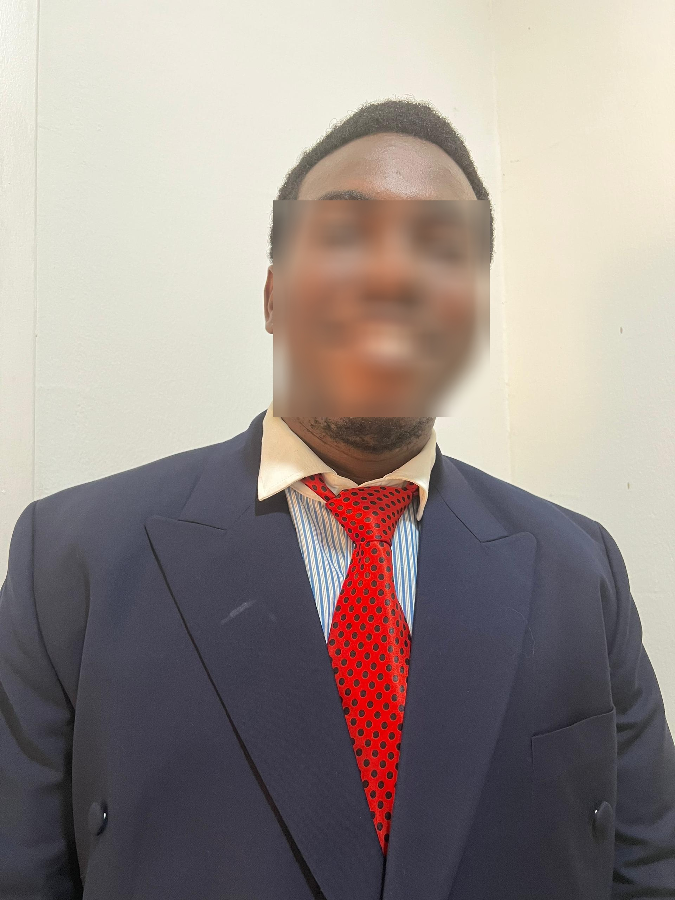

# Face Anonymization with OpenCV and MediaPipe

This project provides scripts to automatically detect and blur faces in images, videos, and webcam streams using OpenCV and MediaPipe. It is useful for anonymizing faces in media for privacy and compliance purposes.

## Features
- **Image Anonymization:** Blur faces in a static image.
- **Video Anonymization:** Blur faces in a video file.
- **Webcam Anonymization:** Blur faces in real-time from your webcam.

## Installation
1. Clone this repository:
   ```bash
   git clone <your-repo-url>
   cd Anonymizing_Face_detections
   ```
2. Install the required dependencies:
   ```bash
   pip install -r requirements.txt
   ```

## Usage

### 1. Blur Faces in an Image
```bash
python blurimg.py
```
- Input: `img1.jpg` (place your image in the project directory with this name or modify the script)
- Output: `blurred_images/blurred_img.jpg`

### 2. Blur Faces in a Video
```bash
python blurvideo.py --mode video --filepath <path_to_video>
```
- Output: `blurred_images/blurred_video.mp4`

### 3. Blur Faces from Webcam
```bash
python blurwebcam.py --mode webcam
```
- Output: `blurred_images/blurred_video.mp4`
- Press `q` to stop the webcam stream.

### 4. Blur Faces in an Image or Video (with arguments)
You can also use `blurwebcam.py` for images and videos:
```bash
python blurwebcam.py --mode image --filepath <path_to_image>
python blurwebcam.py --mode video --filepath <path_to_video>
```

## Example Outputs

### Input Image


### Blurred Image Output


### Blurred Video Output
[Download Blurred Video](./blurred_images/blurred_video.mp4)

## Project Structure
```
Anonymizing_Face_detections/
├── blurimg.py         # Script for image anonymization
├── blurvideo.py       # Script for video anonymization
├── blurwebcam.py      # Script for webcam/image/video anonymization
├── requirements.txt   # Python dependencies
├── img1.jpg           # Sample input image
├── output.jpg         # (Optional) Output image
└── blurred_images/    # Output directory for blurred images/videos
```

## Contact
- **LinkedIn:** [Michael Micah](https://www.linkedin.com/in/Michael-Micah003/)
- **Email:** makoflash05@gmail.com

---
*Feel free to reach out for collaboration or questions!* 